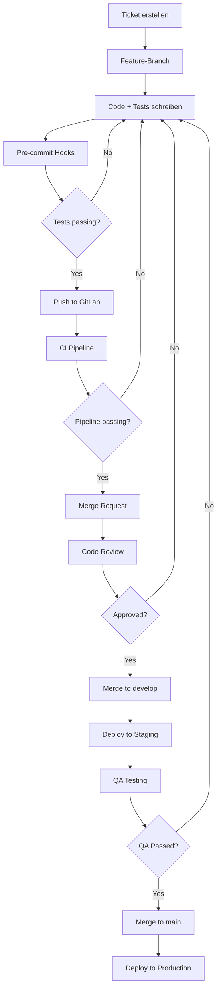

## 15. ENTWICKLUNGS-WORKFLOW

### 15.1 Feature-Development

### 15.2 Definition of Done

**Feature ist "Done" wenn:**
- [ ] Code geschrieben und reviewed
- [ ] Unit-Tests geschrieben (≥70% Coverage)
- [ ] Integration-Tests geschrieben
- [ ] E2E-Tests aktualisiert (wenn nötig)
- [ ] Documentation aktualisiert
- [ ] API-Dokumentation aktualisiert (OpenAPI)
- [ ] Migration-Scripts geschrieben (wenn DB-Änderungen)
- [ ] Security-Review durchgeführt
- [ ] Performance-Tests durchgeführt
- [ ] Deployed to Staging
- [ ] QA-Approved
- [ ] Changelog aktualisiert
- [ ] Release-Notes erstellt (für User-facing Features)

### 15.3 Code-Review-Checklist

**Reviewer checkt:**
- [ ] Code folgt Coding-Standards (ESLint/Prettier)
- [ ] Tests vorhanden und sinnvoll
- [ ] Keine Security-Probleme (SQL-Injection, XSS, etc.)
- [ ] Keine Performance-Probleme (N+1 Queries, Memory-Leaks)
- [ ] Error-Handling korrekt implementiert
- [ ] Logging angemessen (keine sensitiven Daten)
- [ ] API-Backwards-Compatibility gewahrt
- [ ] Documentation vollständig
- [ ] No console.log() in Production-Code
- [ ] Keine TODO/FIXME ohne zugehöriges Ticket

---
